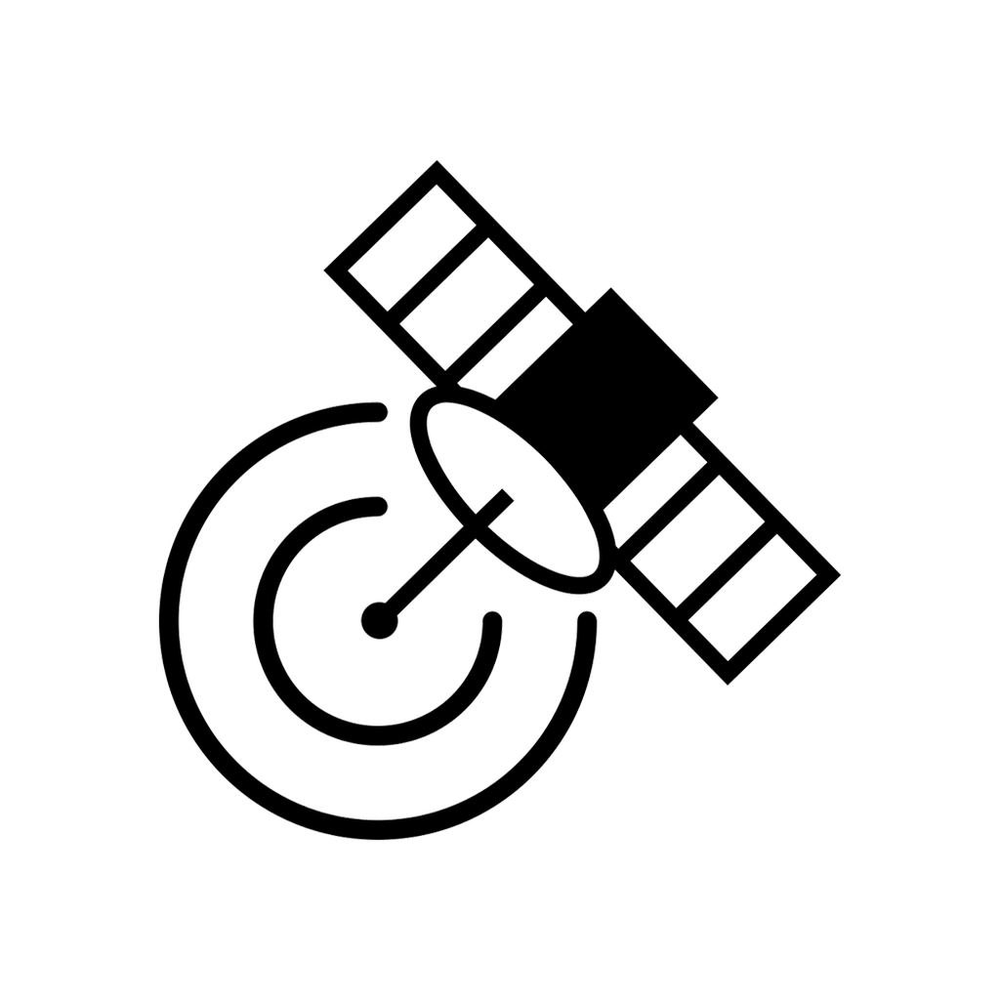
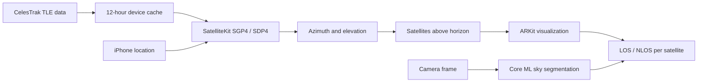

<div align="center">
  
  <h1>SatViewAR</h1>
  <p><strong>See the GNSS satellites above you, directly in augmented reality.</strong></p>
  <p>
    <a href="https://apps.apple.com/au/app/satviewar/id6471916876"></a>
    <a href="https://www.youtube.com/watch?v=IyCVtOgI_Wc"></a>
    
    
    <a href="LICENSE"></a>
  </p>
</div>

SatViewAR is an experimental iPhone app for exploring satellite visibility in the world around you. It calculates the current azimuth and elevation of GNSS satellites on the device, places satellites above the horizon into an ARKit scene, and segments the sky in the camera feed to estimate potential line-of-sight (LOS) and non-line-of-sight (NLOS) conditions.

<p align="center">
  
  
</p>

## What it does

- Visualizes visible GPS, GLONASS, Galileo, BeiDou, and SBAS satellites in AR.
- Calculates satellite positions locally with SatelliteKit using current CelesTrak TLE data.
- Automatically loads satellites after the first valid device location is received.
- Lets you filter by constellation and refresh the calculation at any time.
- Scans continuously for LOS and NLOS assessment: start a scan, turn around, and each
  satellite is classified as it comes into view.
- Runs a bundled Core ML sky segmentation model on the Neural Engine at camera frame rate.

## How it works



The app requests public TLE files from CelesTrak and caches each constellation for 12 hours. If a refresh fails, cached data up to 72 hours old can be used. SatelliteKit propagates each valid orbit at the current time and calculates its position relative to the iPhone.

### Sky segmentation

Each camera frame is read straight from `ARFrame.capturedImage` and passed to a Core ML
model that labels every pixel as sky or not sky. Projecting a satellite onto the frame and
reading the mask at that point gives its LOS or NLOS classification.

The model is a binary sky segmenter, which is a much smaller problem than the general
150-class scene parsing the app previously used, so it runs on the Neural Engine at camera
frame rate rather than a few frames per second. That is what makes continuous scanning
possible: a single tap starts the scan and satellites are classified as you turn.

Frames are dropped rather than queued while one is being processed, so the overlay stays in
step with the camera.

### Privacy boundary

Your latitude, longitude, altitude, camera image, and segmentation output stay on the device. SatViewAR does not send your location to a custom backend. The only satellite-data requests are constellation TLE downloads from CelesTrak.

## Requirements

- An ARKit-capable iPhone running iOS 16.4 or later
- Xcode with an Apple development team configured for device signing
- Internet access for the first TLE download

## Build and run

```bash
git clone https://github.com/SeanBaek111/SatViewAR.git
cd SatViewAR
open GnssFinder.xcodeproj
```

SatelliteKit is pinned to version 2.1.2 and resolves automatically through Swift Package Manager. There are no other dependencies and no package manager to run first. In Xcode, select the `GnssFinder` scheme, choose a connected iPhone, and press Run.

AR tracking and the camera feed both require real hardware, so a physical iPhone is the supported run target.

## Using SatViewAR

1. Grant camera and location permission.
2. Wait for the first location fix. The app loads the visible satellites automatically.
3. Point the iPhone toward the sky and move around to inspect the AR markers.
4. Select All or an individual constellation to recalculate the view.
5. Tap Refresh whenever you want updated satellite positions.
6. Tap Measure to start a scan, then turn slowly through the sky. Satellites are classified
   as they enter the frame and their markers disappear once judged. The scan stops on its
   own when nothing is left unchecked, or tap Stop to end it early.

## Tests

The TLE parser, constellation mapping, cache policy, automatic-load gate, and orbit calculations live in the standalone `SatViewAROrbit` Swift package.

```bash
swift test
```

To verify the complete unsigned iPhone build:

```bash
xcodebuild \
  -project GnssFinder.xcodeproj \
  -scheme GnssFinder \
  -destination 'generic/platform=iOS' \
  CODE_SIGNING_ALLOWED=NO \
  build
```

## Project structure

```text
SatViewAR/
├── gnssfinder/                 iOS app, AR scene, and segmentation workflow
├── Sources/SatViewAROrbit/     TLE loading, caching, and orbit calculation
├── Tests/SatViewAROrbitTests/  Deterministic Swift package tests
├── Package.swift               SatelliteKit package integration
└── tools/                      Project maintenance scripts
```

## Accuracy and limitations

SatViewAR is a visualization and research prototype. Results depend on TLE age, device location, compass calibration, motion-sensor accuracy, AR tracking, and segmentation quality. LOS and NLOS classifications are estimates. The app does not modify the iPhone positioning solution and must not be used for safety-critical navigation.

## App Store and demo

- [View SatViewAR on the Apple App Store](https://apps.apple.com/au/app/satviewar/id6471916876)
- [Watch the demo on YouTube](https://www.youtube.com/watch?v=IyCVtOgI_Wc)

## Contributing

Bug reports and focused pull requests are welcome. Please open an issue before proposing a substantial behavior or architecture change.

## License

Licensed under the [Apache License 2.0](LICENSE).
